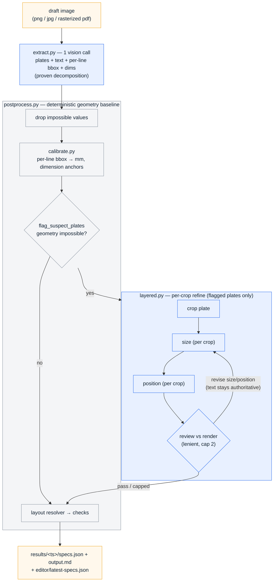

# label-extractor

Extracts manufacturing label specs from client draft images (hand-drawn
sketches, photos, CAD-style drawings) into JSON ready for the label editor
(Text | Position from left (mm) | Position from top (mm) | Text Size).

## Pipeline

The default pipeline is **hybrid** — it plays each approach to its strength.
The proven single vision call (`extract.py`) does what it is good at:
decomposing the sheet into plates and reading their text. The deterministic
`calibrate.py` turns per-line pixel boxes into mm — this is the geometry
baseline (it scores KISO 100%). Only plates whose geometry comes out
physically impossible get re-measured by the per-crop **layered** stages, so
simple and tall/dense strips keep the proven path and just the genuinely
broken plates pay for extra vision calls.



Why hybrid, in one line each:

- **extract.py** (single call) is the most reliable at *decomposition and
  text* — it reads KISO's two strips and their labels correctly where the
  full-layered `detect` stage fragments them.
- **calibrate.py** is the most reliable at *geometry on tall/dense strips*
  (per-line bbox → mm), scoring KISO positions 100% where the layered
  `position` stage compresses them.
- **layered.py** stages (`size` / `position` on a clean crop) are the most
  reliable at *geometry on simple plates* — so they run only when
  `flag_suspect_plates` marks a plate's baseline geometry impossible. Text is
  never re-read there; extract stays authoritative.

`--layered` still runs the full staged pipeline (detect→size→position→review)
and `--single` runs just extract + reconciliation, for comparison.

Design principles:

- **Right tool per job.** Decomposition/text = one call; baseline geometry =
  calibrate; per-crop refine = layered stages, triggered not blanket.
- **Structured output enforced by the server.** Every schema is sent as
  `response_format: json_schema`, so responses are always structurally valid.
- **x/y are the CENTER of the text** (the editor's anchor convention).
- **Value provenance is tracked per field**: plain = annotated, `measured_fields`
  (`~` in output.md) = bbox/crop-measured, `computed_fields` (`*`) = resolver
  default — verify computed values before manufacturing.
- **Prompts stay layout-agnostic.** No texts, guide positions, or offsets from
  any specific drawing. Keep it that way.

## Usage

```
python main.py [image_path]            # layered pipeline (default)
python main.py [image_path] --single   # legacy single vision call
```

Env overrides: `API_URL`, `MODEL`, ... (see api_client.py).

## Editor preview (replica)

Single-page replica of the label editor UI to eyeball pipeline output:

```
python -m http.server 8641
# open http://localhost:8641/editor/index.html
```

File ▸ Open specs.json (or drag-drop one from `results/<ts>/`). Red chips
switch between labels; the table (Text | Position from left | Position from
top | Text Size) is editable and re-renders the mm-scaled plate live.
Orange values = filled by the layout resolver, verify them. File ▸ Download
saves the edited spec.

## Eval (anti-overfitting)

```
python eval/run_eval.py [--cached]
```

Images live in `eval/images/`, hand-verified ground truths in
`eval/expected/<name>.json` (raw-extraction shape: annotated values only,
`null` elsewhere). To add a case: drop the image in, run the pipeline once,
hand-correct the prediction from `eval/predictions/`, save it as expected.

**Every prompt or schema change must be scored against ALL eval images,
never tuned on a single one** — that is how the previous pipeline ended up
overfitted.

Scores: label count, text match %, positions within ±2mm, null precision
(catches invented numbers).

## Known limits

- **Plate decomposition on dense grids is the load-bearing risk.** Stage 1
  runs on the full sheet; on a bordered table where each row is one full-width
  plate with column *zones* (e.g. `eval/images/image003.png`), detect tends to
  over-split each row into per-column plates. Per-plate review structurally
  cannot catch a wrong split/merge — each fragment looks locally valid. This
  ambiguity is under-determined from the image alone (a human needs domain
  context too). Simple drafts (single-plate CAD, the common IMark case) work
  well; dense grids need review/correction.
- The layered `detect` stage can also mis-read a noisy multi-strip photo that
  the single-call path read cleanly — see the "hybrid (proven decomposition +
  layered geometry)" direction under discussion.
- `eval/run_eval.py` currently scores the `--single` extraction, not the
  layered stages — the harness needs pointing at the layered pipeline.
- Very messy low-res handwriting (`eval/images/handwriting.jpg`) still
  mis-transcribes — consider client photo-quality guidance or preprocessing.
- xlsx/PDF client inputs are out of scope (image pipeline only); rasterizing
  PDFs is a possible future extension.
