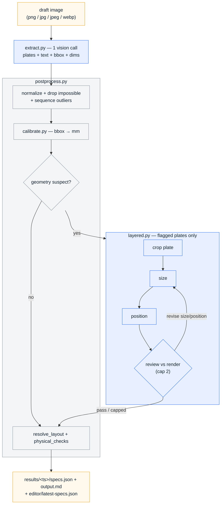

# label-extractor

Extracts manufacturing label specs from client draft images (hand-drawn
sketches, photos, CAD-style drawings) into JSON ready for the label editor
(Text | Position from left (mm) | Position from top (mm) | Text Size).

## Pipeline

One path — `python main.py [image_path]`. Each step does what it is best at:

1. **extract.py** — one vision call: decompose the sheet into plates, transcribe
   text, return per-line `bbox_px` and any annotated mm values.
2. **postprocess.py** — deterministic geometry: normalize, drop impossible
   values, snap sequence outliers, then **calibrate.py** (bbox → mm).
3. **layered.py** — per-crop refine *only* when `flag_suspect_plates` marks a
   plate's baseline geometry as physically impossible (size → position → review).
4. **resolve_layout** + **physical_checks** — fill remaining nulls with defaults,
   emit warnings, write output.



**One line:** image → extract → calibrate → (refine if needed) → resolve → JSON.

### Why this split

- **extract.py** owns *decomposition and text* — one full-sheet call keeps dense
  multi-strip layouts intact.
- **calibrate.py** owns *baseline geometry* — per-line bbox → mm, anchored on
  dimension lines where the draft has them.
- **layered.py** owns *rescue geometry* — per-crop size/position only when the
  baseline is physically impossible. Text is never re-read; extract stays
  authoritative.

### Design principles

- **Structured output enforced by the server.** Every schema is sent as
  `response_format: json_schema`, so responses are always structurally valid.
- **x/y are the CENTER of the text** (the editor's anchor convention).
- **Value provenance is tracked per field**: plain = annotated, `measured_fields`
  (`~` in output.md) = bbox/crop-measured, `computed_fields` (`*`) = resolver
  default — verify computed values before manufacturing.
- **Prompts stay layout-agnostic.** No texts, guide positions, or offsets from
  any specific drawing. Keep it that way.

## Usage

```
python main.py [image_path]      # default: draft.png
```

Env overrides: `API_URL`, `MODEL`, ... (see `api_client.py`).

## Editor preview (replica)

Single-page replica of the label editor UI to eyeball pipeline output:

```
python -m http.server 8641
# open http://localhost:8641/editor/index.html
```

File ▸ Open specs.json (or drag-drop one from `results/<ts>/`). Red chips
switch between labels; the table (Text | Position from left | Position from
top | Text Size) is editable and re-renders the mm-scaled plate live.
Orange values = filled by the layout resolver, verify them. File ▸ Download
saves the edited spec.

## Eval (anti-overfitting)

```
python eval/run_eval.py [--cached]
```

Images live in `eval/images/`, hand-verified ground truths in
`eval/expected/<name>.json` (raw-extraction shape: annotated values only,
`null` elsewhere). To add a case: drop the image in, run the pipeline once,
hand-correct the prediction from `eval/predictions/`, save it as expected.

**Every prompt or schema change must be scored against ALL eval images,
never tuned on a single one** — that is how the previous pipeline ended up
overfitted.

Scores: label count, text match %, positions within ±2mm, null precision
(catches invented numbers).

Note: the eval harness scores **extract + calibrate** only — not the per-crop
refine stages.

## Known limits

- **Plate decomposition on dense grids is the load-bearing risk.** The extract
  call runs on the full sheet; on a bordered table where each row is one
  full-width plate with column *zones* (e.g. `eval/images/image003.png`), the
  model tends to over-split each row into per-column plates. Per-plate refine
  structurally cannot catch a wrong split/merge — each fragment looks locally
  valid. Simple drafts (single-plate CAD) work well; dense grids need human
  review/correction.
- Very messy low-res handwriting (`eval/images/handwriting.jpg`) still
  mis-transcribes — consider client photo-quality guidance or preprocessing.
- PDF/xlsx client inputs are out of scope (image pipeline only); rasterize PDFs
  to png/jpg before running.
