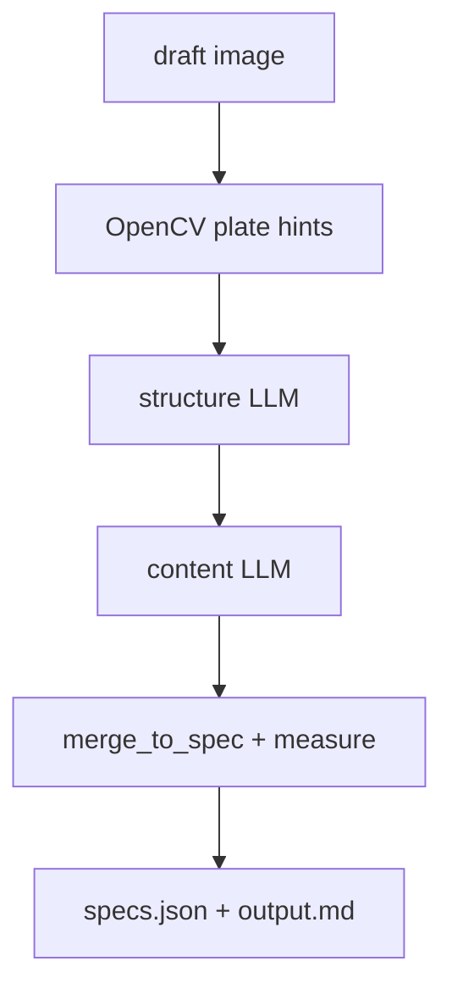

# label-extractor

Extracts manufacturing label specs from client draft images (hand-drawn
sketches, photos, CAD-style drawings) into JSON ready for the label editor
(Text | Position from left (mm) | Position from top (mm) | Text Size).

## Pipeline

One path — `python main.py [image_path]`. Dual-call flow:

1. **structure** — draft metadata, dimension annotations, plate regions (OpenCV hints + LLM)
2. **content** — text, positions, sizes per plate on the full sheet
3. **measure** — deterministic px→mm merge and plate layout refinement



**Vision calls:** 2 per sheet (structure + content). Bbox detection is OpenCV — not billed as LLM.

### Design principles

- **Two calls, full sheet** — structure then content; no per-plate crop loop
- **Content vs derived resolution** — trust LLM mm when complete; derive from bbox on wide strips
- **Null stays null** — warnings instead of aggressive default-fill
- **Structured output** via `response_format: json_schema`
- **x/y are the CENTER of the text** (editor anchor convention)

## Usage

```
python main.py [image_path]      # e.g. sample-data/drawing.png
python main.py --all             # every image in sample-data/
```

Env overrides: `API_URL`, `MODEL`, `AGENTIC_EXTRACT_MAX_CONCURRENT`, ... (see `api_client.py`).

LLM cache under `results/current/_<model>_<timestamp>/llm/` (`dual-structure`, `dual-content`).
Set `LLM_CACHE=0` to disable.

Stage snapshots under `results/current/_<model>_<timestamp>/stages/`:

| File | After |
|------|--------|
| `01_structure.json` | structure LLM + CV reconcile |
| `02_content.json` | content LLM |
| `03_measure.json` | final spec after merge/measure |

Reprocess cached stages without new LLM calls:

```
python scripts/reprocess.py <run_id>
```

Run every image in `sample-data/` (same as `main.py --all`):

```
uv run main.py --all
```

## Editor preview

```
python -m http.server 8641
# open http://localhost:8641/editor/index.html
```

Pick a run from `results/current/` or `results/benchmark-models/` in the dropdown, or load `editor/latest-specs.json`
(updated automatically after each `main.py` extract).

## Benchmark

```
python benchmark/run_benchmark.py [--cached]
```

Test images in `sample-data/`. Ground truths in `benchmark/expected/<name>.json`.
Scores: label count, text match, position ±2mm, null precision.

## Known limits

- Dense CAD grids rely on OpenCV contour detection in `plate_detect.py`; very faint or photo-based drafts may need tuning.
- Wide strip plates (aspect ≥ 4) use derived layout refinement; simple multi-line plates trust content when complete.
- PDF inputs: rasterize to png/jpg first.
