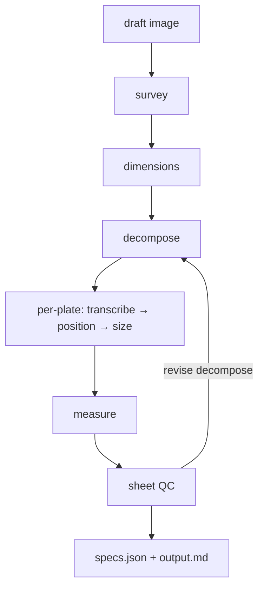

# label-extractor

Extracts manufacturing label specs from client draft images (hand-drawn
sketches, photos, CAD-style drawings) into JSON ready for the label editor
(Text | Position from left (mm) | Position from top (mm) | Text Size).

## Pipeline

One path — `python main.py [image_path]`. Designer-style multi-node flow:

1. **survey** — draft type, global material notes; `image_px` from file (PIL)
2. **dimensions** — dimension lines with `span_px` in real file pixels
3. **decompose** — **OpenCV** plate outlines (grounded bbox) + LLM mm labels only
4. **per-plate** — crop then transcribe → position → size (text-only size call)
5. **measure** — deterministic px→mm from bboxes (no heuristic repair)
6. **sheet QC** — pass/revise with optional one retry



**Vision calls (happy path):** `4 + 3N` where N = plate count (survey + dimensions + plate-dims + 3 per plate + QC). Bbox detection is OpenCV — not billed as LLM.

### Design principles

- **One node = one task** — short prompts, small schemas
- **SheetContext** carries `dimension_annotations` and `plate_regions` between nodes
- **Null stays null** — no aggressive default-fill; warnings instead
- **Structured output** via `response_format: json_schema`
- **x/y are the CENTER of the text** (editor anchor convention)

## Usage

```
python main.py [image_path]      # default: draft.png
```

Env overrides: `API_URL`, `MODEL`, `AGENTIC_EXTRACT_MAX_CONCURRENT`
(default `4` — parallel per-plate LLM requests), ... (see `api_client.py`).

LLM cache under `results/<timestamp>/llm/` (`survey`, `dimensions`, `decompose`,
`transcribe#3`, `pos#3`, `size#3`, `qc`). Set `LLM_CACHE=0` to disable.

Stage snapshots under `results/<timestamp>/stages/`:

| File | After |
|------|--------|
| `01_survey.json` | survey |
| `02_dimensions.json` | dimensions |
| `03_decompose.json` | decompose |
| `06_size.json` | per-plate transcribe + position + size |
| `07_measure.json` | px→mm |
| `08_qc.json` | sheet QC |
| `09_output.json` | final spec |

## Editor preview

```
python -m http.server 8641
# open http://localhost:8641/editor/index.html
```

## Eval

```
python eval/run_eval.py [--cached]
```

Ground truths in `eval/expected/<name>.json`. Scores: label count, text match,
position ±2mm (after measure), null precision (before measure).

## Known limits

- Dense CAD grids rely on OpenCV contour detection in `plate_detect.py`; very faint or photo-based drafts may need tuning.
- `dimensions.span_px` still comes from the LLM — used only as fallback when plate mm is missing.
- More API calls than the old monolithic extract (trade-off for task clarity).
- PDF inputs: rasterize to png/jpg first.
